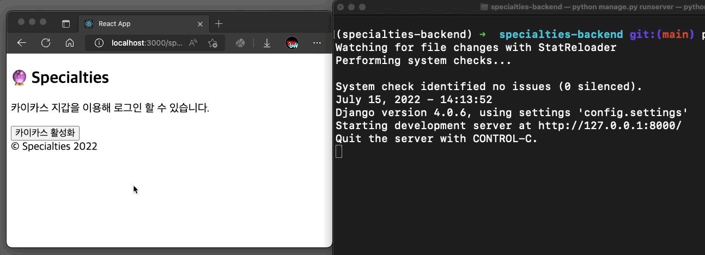

# 🔮 Specialties

누구나 쉽게 블록체인을 이용해 커뮤니티를 만들 수 있는 서비스입니다. w3에 걸맞게 모든 커뮤니티는 각각 하나의 DAO로서 활동할 수 있도록 하는 tool을 제공하는 것이 궁극적인 목표입니다.

**Klaytn Blockchain**을 사용합니다.

**현재까지 구현한 web3 로그인 기능입니다**

Backend에서 signed message decode를 통한 auth까지 구현이 돼있습니다.

# 서비스 설명

각 사용자는 모두 카이카스 지갑으로만 로그인 할 수 있으며, 재화는 오가지 않기 때문에 사용자 인증은 필요 없습니다.

사용자는 커뮤니티 리더, 커뮤니티 코어 멤버, 혹은 커뮤니티 멤버로서 활동할 수 있습니다. 누구나 리더로서 활동할 수 있으며, 각 커뮤니티 리더는 처음 커뮤니티를 열 때 **특정 조건의 사람들만 모집할 수 있습니다.**

## 특정 조건이란

1. 특정 NFT의 n개 이상 소지자
2. 특정 토큰의 n개 이상 소지자

이같은 조건을 자유롭게 걸 수 있으며, 이외 모든 블록체인 외적인 조건은 가할 수 없습니다.

각 커뮤니티가 독자적인 DAO로서 활동하고 싶을 경우를 위해 직접 NFT를 민팅해서 모일 수 있는 옵션 또한 부여하고자 합니다.

## 커뮤니티

- **커뮤니티 리더**: 처음 커뮤니티를 생성한 리더입니다. 리더는 커뮤니티의 구성 등을 변경할 수 있고, 커뮤니티 구성원들을 관리할 책임이 있습니다. 그러나, 아무리 리더라 하더라도 멤버들을 마음대로 할 수는 없습니다. 거의 모든 결정은 DAO에 의해서만 의결됩니다.
- **커뮤니티 코어 멤버**: 리더가 직접 지정할 수 있습니다. 각 코어 멤버는 '구성원 관리'의 안건을 DAO 의제로 올릴 수 있는 권한이 주어집니다.
- **커뮤니티 멤버**: 누구나 그 어떤 안건이든 DAO에 의제로 상정할 수 있으며, 누구나 동등한(여기에서 동등함이란, Portion에 따릅니다) 투표권(=ticket)을 가집니다. 심지어 '리더 혹은 코어 멤버의 탄핵' 또한 의결이 가능합니다.

## DAO 안건

DAO 안건은 두가지 타입으로 나뉩니다.

1. 커뮤니티 관리 관련 안건
2. 커뮤니티 외적인 안건

이 중 1번 안건은 Specialties에서 Pre-built 안건으로 제공합니다.

## 안건은 블록체인에 기록되나요?

이는 리더가 결정할 수 있게 할 방침입니다. 그러나, 리더는 이 경우 블록체인 이용 수수료를 부담해야 하므로, 이 옵션을 사용하지 않더라도 블록체인과 같은 효과를 누릴 수 있도록 **수정과 삭제가 불가능**하도록 할 예정입니다.

다만, 커뮤니티 리더는 커뮤니티 관리자로서 글의 삭제는 가능합니다.

# Stack

## Frontend

`React.js` : 한국에서는 클레이튼 블록체인이 가장 활성화 돼있는데, `Klip` 지갑 관련 개발에는 기업체 인증 등의 과정이 필요해 Web Service로서 기획했습니다. 추후 발전한다면 모바일 중심적인 서비스의 개발도 할 예정입니다.

## Backend

`Django` : 상황에 따라 `Spring`으로 바뀔 수 있습니다.

# 개발 일정 계획

## ~ 7월

- Frontend 가계발
- Backend 가계발
- MVP test

## ~ 8월

- 추가 개발
- MVP 완성

# TIL

## useState is Asynchronous

`useState`는 비동기로 작동됩니다. 따라서, state를 변경했을 때 변경된 state를 이용한 logic이 필요하다면 `useEffect`에서 callback Function을 정의해줘야 합니다. (`setState` 자체가 `Promise` 형식을 리턴하지 않습니다)

## Web3 기반의 로그인 Full Stack 구현하기

블록체인 관련 개발은 Node.js를 이용해 NFT를 민팅해보거나, NFT 관련 정보 조회가 가능한 디스코드 봇을 개발해본 경험이 전부였는데, Full Stack으로 Web3 Auth를 구현해보는 과정이 정말 재밌었어요😁

### 인증 Flow

전체적으로 Backend에서 무작위로 생성된 Nonce를 Client의 블록체인 지갑으로 서명하면, 이 서명된 메세지를 다시 Backend에서 검증하는 흐름입니다.

1. Front-end에서 Kaikas 지갑 유무 확인 후 '카이카스 지갑 활성화' 버튼 활성화
   지갑으로 서명을 하려면 우선 사용자의 지갑에 서비스를 연결해야 합니다.
2. Kaikas 지갑 활성화 확인 후 '로그인 하기' 버튼 활성화
3. (로그인 요청이 오면) Back-end에서 무작위로 Nonce 생성
4. Kaikas 지갑으로 Nonce와 약간의 안내 문구로 구성된 message를 Web3.js sign후 Backend로 인증 요청
5. 서명된 message를 web3 package 활용해 Validation 검사
   - 앞서 생성된 Nonce와 서명된 message를 이용해 사용자의 지갑 주소를 복구할 수 있어 이렇게 복구된 지갑 주소가 사용자의 지갑 주소가 맞는지 확인합니다.
   - web3 모듈은 Ethereum 기준으로 개발된 모듈로, Klaytn Blockchain에 맞게 아주 약간의 수정이 필요했습니다.
6. Validation을 통과하면 User를 생성하고 로그인 토큰을 생성(Django Rest Framework에서 제공하는 authtoken 활용)해 Client로 전송
   - 추후 다시 Validation이 필요할 때(재로그인 등)를 대비해 사용자의 Nonce를 재발급합니다. Nonce는 각 User에 저장됩니다.
7. 로그인!
